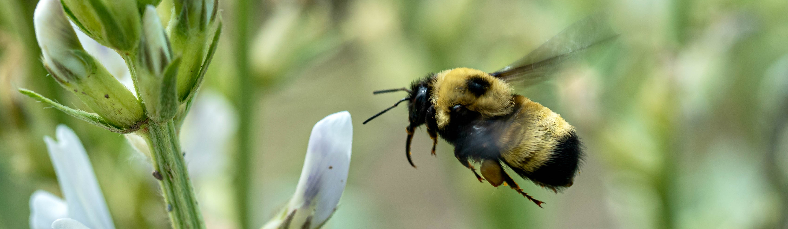

# Locoweed Volatiles 2026

[](https://doi.org/10.5281/zenodo.22928586)



Analysis of volatile organic compound (VOC) profiles in *Oxytropis sericea* (white locoweed) comparing plants with and without the endophytic fungus *Alternaria oxytropis* (formerly *Undifilum oxytropis*). Endophyte status is confirmed by seed wash assay (SWA); plants were spatially paired (E+ / E-) to control for microsite and genetic variation.

Data were collected in a greenhouse setting (Spring 2022, Spring 2023) and from natural field populations (2022, 2023). A 2019 historical field dataset is included for supplemental visualization only.

This archive accompanies the manuscript "*Volatile insensitivity and localized alkaloids support commensalism in the Oxytropis sericea–Alternaria oxytropis association*" and contains the raw data, processing documentation, analysis scripts, and figures needed to reproduce the reported results.

---

## Repository Structure

```
oxytropis-alternaria-volatiles_2026/
├── data-files/                          Raw source spreadsheets (all years/datasets)
│   ├── 2022 Field Locoweed.xlsx
│   ├── 2023 Field Locoweed.xlsx
│   ├── Locoweed Field Volatiles 2018.xlsx
│   ├── Locoweed Field Volatiles 2019 Summary.xlsx
│   ├── Spring 2022 GH Locoweed RESULTS.xlsx
│   └── Spring GH 23 Locoweed Volatiles.xlsx
├── proc-docs/                           Data-processing notebooks (raw -> cleaned long format)
│   ├── GH-data-proc.Rmd
│   └── Field-data-proc.Rmd
├── scripts/                             Analysis pipeline (see "How to Run" below)
│   ├── 00_load_data.R
│   ├── 01_clr_processing_2.R
│   ├── 02_permanova_2.R
│   ├── 02.5_total_voc.R
│   ├── 03_pca_2.R
│   ├── 04_simper.R
│   ├── 05_univariate.R
│   ├── 06_power_analysis.R
│   ├── dbRDA.R
│   ├── 0X_results.R                     Sources the pipeline and prints all key results
│   ├── table1_permanova.R
│   ├── fig1_gh_pca.R
│   ├── fig2_field_pca.R
│   ├── fig3_means.R
│   ├── fig4_swacontent.R
│   └── fig5_pollinators.R
├── figures/                             Manuscript figures and supplementary tables
│   ├── Fig1_GH_PCA.png
│   ├── Fig2_Field_PCA.png
│   ├── Fig3_paired_means.png
│   ├── Fig4_swa_cont.png
│   ├── Fig5_nectar.png
│   ├── Supp Table 1_rawgh.xlsx
│   ├── Supp Table 2_rawfield.xlsx
│   └── gh_table_raw.xlsx
├── summary_table.csv                    Mean ± SE of each compound by SWA status
├── wiki.md                              Full methodological detail and analytical decisions
└── README.md
```

---

## How to Run

1. Open this folder as the working directory in R/RStudio (all scripts assume the working directory is the project root).
2. Each script in `scripts/` sources its upstream dependencies automatically (e.g. `02_permanova_2.R` sources `01_clr_processing_2.R`, which sources `00_load_data.R`). Paths are relative to the project root, so no manual editing of file paths is required.
3. To reproduce all reported results in one pass, run `scripts/0X_results.R`, which sources the full pipeline (`02_permanova_2.R`, `04_simper.R`, `05_univariate.R`) and prints every key result to the console.
4. Individual figure/table scripts (`fig1_gh_pca.R`, `table1_permanova.R`, etc.) can be run independently — each sources only the upstream scripts it needs.
5. For details on how raw spreadsheets in `data-files/` were cleaned into the long-format objects used by the scripts, see `proc-docs/`.

See `wiki.md` for full methodological detail, analytical decisions, and known data issues.

---

## Dependencies

Install required packages in R:

```r
install.packages(c("tidyverse", "readxl", "vegan", "compositions", "ggrepel",
                   "indicspecies", "patchwork", "lme4", "lmerTest", "ggh4x",
                   "rstudioapi", "knitr"))
```

---

## Citation

This repository is archived on Zenodo and is publicly available under the DOI [10.5281/zenodo.22928586](https://doi.org/10.5281/zenodo.22928586). If you use these data or code, please cite:

> Strand, J. (2026). *Locoweed Volatiles 2026: data and code for "Volatile insensitivity and localized alkaloids support commensalism in the Oxytropis sericea–Alternaria oxytropis association"* [Data set]. Zenodo. https://doi.org/10.5281/zenodo.22928586

Please also cite the associated manuscript once published.

---

## Authors

Jackson Strand
Department of Land Resources and Environmental Science
Montana State University, Bozeman, MT
